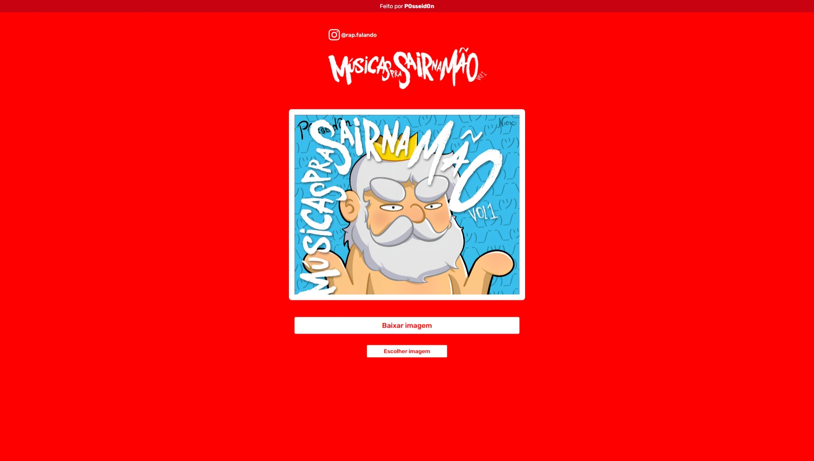

# Músicas Para Sair Na Mão 🥊🔥

Gerador de imagens com o overlay do álbum **"Músicas Para Sair Na Mão"**. Escolha uma foto, aplique o overlay e baixe a imagem pronta para postar!



## 🎵 Links

> **Vai ouvir o álbum agora!**

[](https://open.spotify.com/album/6g2cGMBQOKa6F8WTeMKBby?si=6zB1J5W6ReKYgduIt4-GqQ)
[](https://www.instagram.com/rap.falando/)

## Como funciona

1. Clique em **"Escolher imagem"**
2. Selecione uma foto da sua galeria
3. O overlay do álbum será aplicado automaticamente
4. Clique em **"Baixar imagem"** e pronto!

## Tecnologias

- [Vue 3](https://vuejs.org/) + TypeScript
- [Fabric.js](http://fabricjs.com/) — manipulação do canvas
- [Vite](https://vitejs.dev/) — build tool
- [Bun](https://bun.sh/) — runtime e package manager

## Setup do Projeto

```sh
bun install
```

### Dev

```sh
bun run dev
```

### Build para Produção

```sh
bun run build
```

### Lint

```sh
bun run lint
```

---

**Sério, vai ouvir o álbum:** [Músicas Para Sair Na Mão no Spotify](https://open.spotify.com/album/6g2cGMBQOKa6F8WTeMKBby?si=6zB1J5W6ReKYgduIt4-GqQ) 🎧
